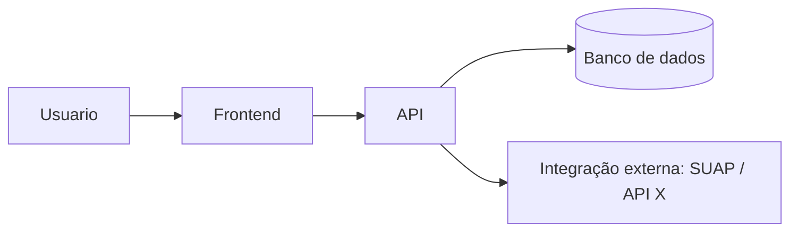

> 📋 **Para usar:** copie este modelo para o `docs/` do repositório da sua equipe e preencha.
> Para copiar o markdown cru, abra [esta página no GitHub](https://github.com/inovatech-ifpi/portal/blob/main/templates/arquitetura.md) e use o botão de copiar.

# Arquitetura Mínima — [Projeto] — Squad [X]

> Template da metodologia. Artefato do **Gate Técnico** (03/07). Não precisa ser definitivo — precisa ser suficiente para começar a implementar com segurança.

## 1. Visão geral

Descreva em 3–5 linhas como a solução se organiza (front-end, back-end, banco, integrações externas).

## 2. Diagrama de arquitetura

Cole aqui o diagrama (imagem, ou texto em Mermaid). Mostre os principais componentes e como conversam.

## 3. Stack escolhida

| Camada | Tecnologia | Por quê |
|---|---|---|
| Front-end | | |
| Back-end | | |
| Banco de dados | | |
| Hospedagem / ambiente | | |
| Integrações | | |

## 4. Decisões técnicas (mini-ADR)

| Decisão | Alternativas consideradas | Escolha e motivo |
|---|---|---|
| | | |

## 5. Pontos em aberto / riscos técnicos

- O que ainda precisa ser investigado ou validado.
