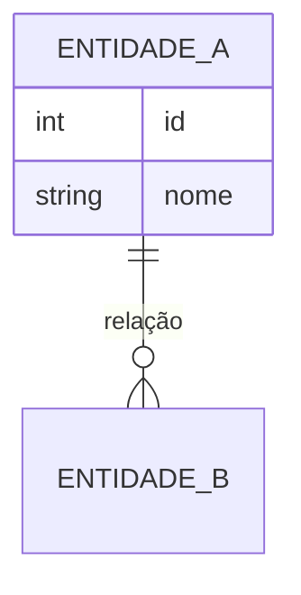

> 📋 **Para usar:** copie este modelo para o `docs/` do repositório da sua equipe e preencha.
> Para copiar o markdown cru, abra [esta página no GitHub](https://github.com/inovatech-ifpi/portal/blob/main/templates/modelo-dados.md) e use o botão de copiar.

# Modelo de Dados — [Projeto] — Squad [X]

> Template da metodologia. Artefato do **Gate Técnico** (03/07). Modele as entidades centrais do escopo mínimo — não o sistema inteiro.

## 1. Entidades principais

Liste as entidades (tabelas/coleções) e o que cada uma representa.

| Entidade | Representa | Observações |
|---|---|---|
| | | |

## 2. Diagrama entidade-relacionamento

Cole o DER (imagem) ou descreva em Mermaid.

## 3. Dicionário de dados (principais campos)

| Entidade | Campo | Tipo | Obrigatório | Descrição |
|---|---|---|---|---|
| | | | | |

## 4. Dados sensíveis / LGPD

Marque quais campos contêm dado pessoal ou sensível e como serão protegidos (acesso restrito, anonimização, etc.).

| Campo | Sensível? | Tratamento |
|---|---|---|
| | | |
